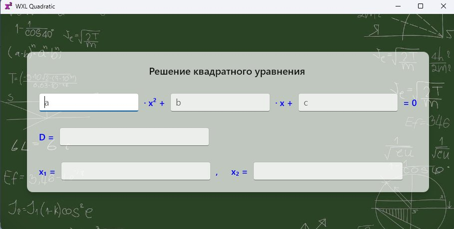

# Quadratic: квадратное уравнение на observable

## Назначение примера

Служить шаблоном для небольших расчётных утилит.

## Обзор реализации

Три коэффициента на входе, дискриминант и два корня на выходе. Всё
приложение — двести строк одного `main.cpp`, GUI-интерфейс одним выражением.

Обработчиков событий ввода нет: правка любого коэффициента сама доходит до
корней и попадает на экран обратно.

Что показано: реактивная модель на `observable`, однонаправленные привязки
`BindInput{}` и `BindOutput{}` вместо обработчиков, `NumberBox` для чисел,
вложенные пресеты, плейсхолдеры полей ввода, картинка фона на сцене
`CompositionWindow` с эффективным отображением и счёт корней без потери точности.

```
cmake --build --preset x64-debug --target sample.quadratic
```

## Модель считает, интерфейс показывает

`Equation` — это поля с оповещением и цепочка пересчёта между ними:

```cpp
answer.follow(a, b, c, solve)       // три числа → ответ
      .on_change(...);              // ответ → три текста
```

`follow()` вычисляет значение сразу и потом при каждом изменении источников,
`on_change` раскладывает ответ по трём показываемым полям. Интерфейс об этой
цепочке не знает: он видит только поля. Коэффициенты — `observable<double>`,
и число в них кладёт привязка к `NumberBox` на каждую клавишу; пустое поле у
него — NaN, и такой коэффициент модель считает не введённым.

## Модель живёт до конца работы

Привязка берёт поле по адресу и никогда им не владеет, поэтому модель обязана
пережить все свои привязки. Окно держит себя само до `WM_NCDESTROY`, а модель
продлевает `Teardown`: `wxl_launched()` заводит её `shared_ptr`-ом и
захватывает в обработчике, который wxl вызывает при завершении программы.

## Привязка вместо обработчиков

`intermediateValue = BindInput{eq.a}` у поля ввода, `text = BindOutput{eq.D}`
у поля вывода — и больше ничего. Направление названо в самой привязке:
коэффициент идёт из `NumberBox` в модель и только туда, модель поле никогда
не переписывает; ответ идёт из модели в `TextBox` и только туда, а поля
ответов объявлены `isReadOnly` и только показывают. Двусторонний `Bind{}`
здесь не нужен ни одному полю.

У `NumberBox` два значения. `value` — подтверждённое: контрол пишет его по
Enter, по уходу фокуса или по кнопке-спиннеру, и до того молчит.
`intermediateValue` — число, каким оно набрано прямо сейчас, на каждую
клавишу: wxl разбирает текст поля тем же форматтером, которым `NumberBox`
подтвердит его сам, так что модель видит то, чем `value` вот-вот станет.
Текст, который числом ещё не стал («−», «1e»), — NaN, и ответ на это время —
прочерки, как при пустом поле.

Ни один контрол не лежит в переменной — всё, ради чего его держали бы, написано
декларативно, включая фокус в первом поле через `onLoaded`.

## Плейсхолдеры вместо подписей

Поля ввода подписаны изнутри: `placeholderText = u"a"`. Строка читается как
формула — `a · x² + b · x + c = 0`, — и подписей рядом с полями не нужно.
Общий вид задают пресеты `common`, `txt`, `input`, `output`; пресеты
вкладываются друг в друга, позволяя использовать определения повторно.

## Фон — на сцене окна, а не в дереве XAML

```cpp
background = BackgroundImage{u"Assets/bk2.jpg", BackgroundFill::UniformToFill}
```

Картинка ложится визуалом на сцену `CompositionWindow`, под прозрачный остров
XAML. `Image` в дереве нет: картинка не участвует в раскладке острова и
меняет размер синхронно в `WM_SIZE`, оттого держится за рамку без отставания при
изменении размера.

Само окно создано с `WS_EX_NOREDIRECTIONBITMAP` — поверхности перенаправления
у него нет вовсе, и в просвете быстрой растяжки за угол не белеет ни пикселя.
Декодирует и держит картинку кэш текстур Win2D, который окно обслуживает само.

## Корни без потери точности

Школьная формула `(−b ± √D) / 2a` верна на бумаге и врёт в `double`. Когда
`b² ≫ 4ac`, `√D` почти равен `|b|`, и у меньшего по модулю корня в числителе
вычитаются два почти равных числа — значащие цифры съедаются:

| `a = 1, b = 1e8, c = 1` | меньший корень  |
| ----------------------- | --------------- |
| школьная формула        | −7.4505806e−09  |
| этот пример             | −1e−08          |
| точное значение         | −1.00000000e−08 |

Пример считает `q = −(b + sign(b)·√D) / 2` — слагаемые одного знака,
вычитания нет — и берёт корни как `q/a` и `c/q`, второй по теореме Виета
(`x₁·x₂ = c/a`). Вырожденные случаи названы прямо: `a = 0` — линейное
уравнение, `b = c = 0` — ℝ, `b = 0` при `c ≠ 0` — ∅, `D < 0` — пара
сопряжённых корней, которые печатаются через `j`.

Ввод разбирает сам `NumberBox`, по правилам текущей локали; вывод — девять
значащих цифр.

## Снимок экрана

